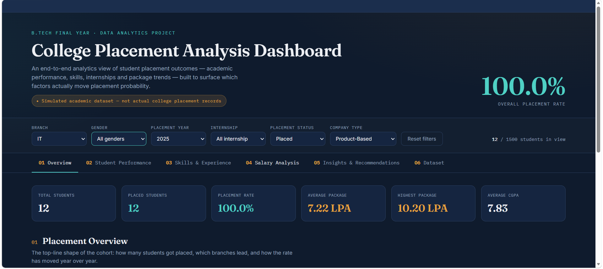

# College Placement Analysis Dashboard

An interactive web-based dashboard for analyzing college placement data, student performance, skills, internships, placement outcomes, and salary trends.

## Dashboard Preview



## Project Overview

The College Placement Analysis Dashboard is an interactive data analytics project designed to explore and visualize student placement-related information.

The dashboard provides KPI cards, interactive filters, charts, analytical views, and automatically generated insights to help understand placement patterns and student outcomes.

## Features

- Interactive college placement analysis dashboard
- 6 KPI cards for quick summary of placement data
- 6 interactive filters
- 13 interactive charts and visualizations
- Student performance analysis
- Skills and internship analysis
- Salary analysis
- Placement outcome analysis
- Insights and recommendations
- Dataset exploration section
- CSV dataset download functionality
- Dynamic calculations based on selected filters
- Responsive web interface

## Dashboard Sections

### 1. Overview
Provides a high-level summary of placement statistics using KPI cards and visualizations.

### 2. Student Performance
Analyzes academic performance and its relationship with placement outcomes.

### 3. Skills & Experience
Explores technical skills, internships, certifications, and other experience-related factors.

### 4. Salary Analysis
Provides visual analysis of salary trends and placement-related compensation.

### 5. Insights & Recommendations
Generates analytical insights and recommendations based on the currently selected filters.

### 6. Dataset
Provides access to the underlying dataset and allows the complete dataset to be downloaded as a CSV file.

## Interactive Filters

The dashboard supports filtering by:

- Branch
- Gender
- Placement Year
- Internship
- Placement Status
- Company Type

The charts, KPI values, insights, and recommendations update according to the selected filters.

## Dataset

The dashboard uses a synthetic dataset containing **1,500 student records**.

The dataset is generated in the browser using a fixed random seed. This ensures that the same dataset is generated every time the dashboard is opened, making the project suitable for consistent demonstrations and screenshots.

Users can also download the complete dataset in CSV format from the Dataset section.

## Technologies Used

- HTML5
- CSS3
- JavaScript
- Chart.js
- Google Fonts

## Project Structure

```text
College-Placement-Analysis-Dashboard/
│
├── index.html
├── Dashboard.png
├── README.md
└── .gitignore
